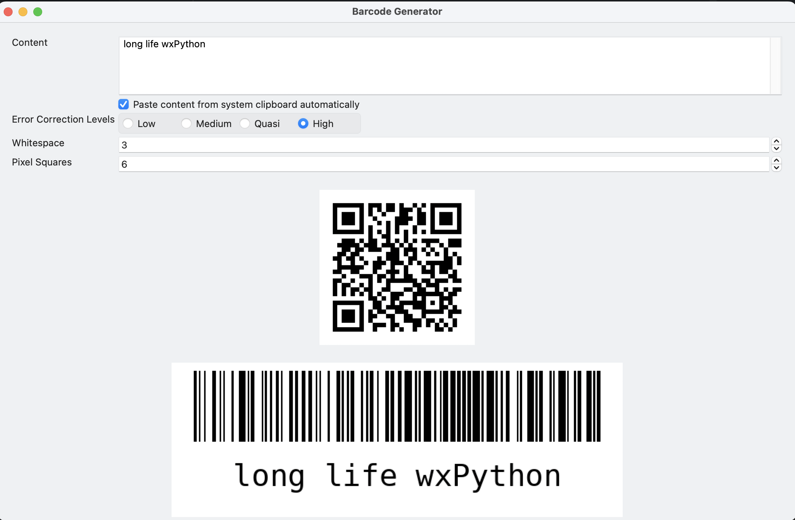

# Introduction

This is a demo program to generate and display QR code and barcode(code128) instantly.
The program look like:

It supports:

- clipboard integration
- L, M, Q, H error correction levels
- customizable margin and pixel size

# How to build standalone binary

Make sure you install pyinstaller 3.6.
Then run:

    pyinstaller --onefile --noconsole barcodeui.py

and get the .exe file under dist directory.
